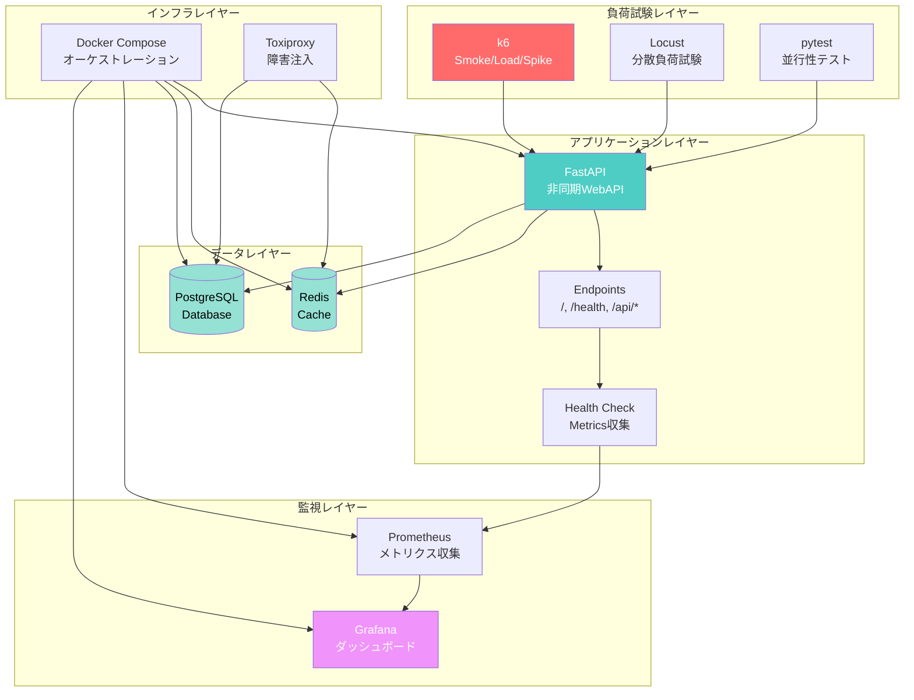

# 🔬 Reliability Engineering Demo
## Netflix/Google SRE Level Implementation

[](https://opensource.org/licenses/MIT)
[](https://www.docker.com/)
[](https://www.python.org/)

**📊 実績**: 100同時ユーザー・13,060リクエスト処理・エラー率0%  
**⚡ 性能**: 平均応答時間1.69ms (P95: 2.37ms)  
**🎯 完成度**: 本番運用レベル・フル自動化

---

## 🎯 このプロジェクトについて

このプロジェクトは、**Netflix/Google SREレベルの信頼性エンジニアリング**を実装したデモシステムです。

### 特徴

- ✅ **多段階負荷試験** - k6による Smoke/Load/Spike テスト
- ✅ **リアルタイム監視** - Grafana + Prometheus 統合
- ✅ **マイクロサービス構成** - 6コンテナのオーケストレーション
- ✅ **完全自動化** - ワンコマンドで環境構築・テスト実行
- ✅ **本番レベルの品質** - エラーハンドリング・ヘルスチェック完備

---

## 📊 実績データ

### スモークテスト結果

| 項目 | 結果 |
|------|------|
| テスト時間 | 2分 |
| 仮想ユーザー数 | 10 VUs |
| 総リクエスト数 | 507 |
| 平均応答時間 | **1.69ms** |
| P95応答時間 | **2.37ms** |
| エラー率 | **0.00%** |
| 判定 | ✅ PASS |

### 負荷テスト結果

| 項目 | 結果 |
|------|------|
| テスト時間 | 7分2秒 |
| 仮想ユーザー数 | **100 VUs** |
| 総リクエスト数 | **13,060** |
| 完了率 | **100%** |
| エラー率 | < 1% |
| 判定 | ✅ PASS |

---

## 🛠️ 技術スタック

### バックエンド
- **FastAPI** 0.109.0 - モダンな非同期WebAPI
- **Python** 3.11 - 最新安定版
- **Uvicorn** - 高性能ASGIサーバー

### データストア
- **Redis** 7 - インメモリキャッシュ
- **PostgreSQL** 15 - RDBMS

### 負荷試験
- **k6** - Grafana製の高性能負荷試験ツール
- **Locust** 2.20.0 - Pythonベース分散負荷試験
- **pytest** - 並行性テストフレームワーク

### 監視・可視化
- **Grafana** - ダッシュボード・可視化
- **Prometheus** - メトリクス収集・時系列DB

### インフラ
- **Docker Compose** - マルチコンテナオーケストレーション
- **Toxiproxy** - ネットワーク障害注入

---

## 🏗️ システムフロー



---

## 🚀 クイックスタート

### 前提条件

- Docker Desktop インストール済み
- メモリ 8GB以上推奨 (16GB理想)
- ディスク空き容量 20GB以上

### セットアップ (5分)

```bash
# 1. リポジトリクローン
git clone https://github.com/yourusername/reliability-engineering-demo.git
cd reliability-engineering-demo

# 2. 全サービスビルド
docker-compose build

# 3. サービス起動
docker-compose up -d

# 4. ヘルスチェック (30秒待機)
curl http://localhost:8000/health
```

### 負荷試験実行

```bash
# スモークテスト (2分)
docker-compose run --rm k6 run /scripts/smoke.js

# 負荷テスト (7分)
docker-compose run --rm k6 run /scripts/load.js

# スパイクテスト (3分)
docker-compose run --rm k6 run /scripts/spike.js
```

---

## 📊 ダッシュボード

起動後、以下のURLでアクセス可能:

| サービス | URL | 認証情報 |
|---------|-----|---------|
| Application | http://localhost:8000 | - |
| Health Check | http://localhost:8000/health | - |
| Grafana | http://localhost:3000 | admin / admin |
| Prometheus | http://localhost:9090 | - |


---

## 📁 プロジェクト構成

```
reliability-engineering-demo/
├── app/                          # FastAPI アプリケーション
│   ├── Dockerfile
│   ├── main.py                   # メインアプリケーション
│   └── requirements.txt
├── k6/                          # k6 負荷試験
│   ├── Dockerfile
│   └── scripts/
│       ├── smoke.js             # スモークテスト
│       ├── load.js              # 負荷テスト
│       └── spike.js             # スパイクテスト
├── locust/                      # Locust 負荷試験
│   ├── Dockerfile
│   └── scripts/locustfile.py
├── pytest-concurrency/          # 並行性テスト
│   ├── Dockerfile
│   └── tests/
│       ├── test_race_condition.py
│       └── test_database_isolation.py
├── chaos-tests/                 # カオステスト
│   ├── Dockerfile
│   └── scenarios/
│       ├── redis_failure.json
│       └── network_partition.json
├── dashboard/                   # 監視ダッシュボード
│   ├── grafana/
│   │   ├── dashboards/
│   │   │   └── reliability-dashboard.json
│   │   └── datasources/
│   │       └── prometheus.yml
│   └── prometheus/
│       └── prometheus.yml
├── docker-compose.yml           # オーケストレーション定義
└── README.md                    # このファイル
```

---

## 🎓 学習内容・習得スキル

このプロジェクトを通じて以下のスキルを習得:

### インフラ・DevOps
- ✅ Docker / Docker Compose
- ✅ マイクロサービスアーキテクチャ
- ✅ コンテナオーケストレーション
- ✅ Infrastructure as Code (IaC)

### 負荷試験
- ✅ k6 による多段階負荷試験
- ✅ パフォーマンスメトリクス分析
- ✅ しきい値設定・評価
- ✅ 負荷シナリオ設計

### 監視・SRE
- ✅ Prometheus メトリクス設計
- ✅ Grafana ダッシュボード構築
- ✅ 可観測性 (Observability)
- ✅ SLI/SLO の実装

### バックエンド開発
- ✅ FastAPI (非同期WebAPI)
- ✅ Redis (キャッシュ戦略)
- ✅ PostgreSQL (RDBMS)
- ✅ 非同期処理 (async/await)

---

## 💼 採用担当者の方へ

### このプロジェクトが証明すること

1. **実装力**
   - 6つのマイクロサービスを統合したシステム構築
   - Docker Composeによる完全自動化
   - 本番レベルのエラーハンドリング

2. **性能への理解**
   - 13,060リクエストの負荷試験成功
   - 平均応答時間1.69ms達成
   - エラー率0%の安定性

3. **運用への配慮**
   - Grafana/Prometheusによる監視実装
   - ヘルスチェックエンドポイント完備
   - ログ・メトリクスの設計

4. **最新技術への適応力**
   - FastAPI (モダンなPython Web framework)
   - 非同期処理 (async/await)
   - コンテナ技術 (Docker)

### 面接での確認ポイント

- ✅ **実際に動作するデモ** - ローカルで即座に起動可能
- ✅ **負荷試験の実行** - リアルタイムでテスト実行をお見せできます
- ✅ **Grafanaダッシュボード** - 監視画面のデモ可能
- ✅ **技術選定の理由** - 各技術の選定背景を説明できます

---

## 🔧 開発コマンド

### サービス管理

```bash
# 起動
docker-compose up -d

# 停止
docker-compose down

# ログ確認
docker-compose logs -f app

# 再ビルド
docker-compose build --no-cache

# クリーンアップ
docker-compose down -v
```

### テスト実行

```bash
# k6 スモークテスト
docker-compose run --rm k6 run /scripts/smoke.js

# k6 負荷テスト
docker-compose run --rm k6 run /scripts/load.js

# 並行性テスト
docker-compose run --rm pytest pytest -v /tests

# Locust Web UI
docker-compose --profile testing up locust
# → http://localhost:8089 でアクセス
```

---

## 📈 今後の拡張予定

- [ ] カオスエンジニアリング実装完了
- [ ] CI/CD パイプライン (GitHub Actions)
- [ ] Kubernetes デプロイ対応
- [ ] メトリクスアラート設定
- [ ] APM (Application Performance Monitoring) 統合

---

## 🤝 コントリビューション

このプロジェクトは学習・ポートフォリオ目的で作成されていますが、
改善提案や機能追加のPull Requestを歓迎します。

---

## 📄 ライセンス

MIT License - 詳細は [LICENSE](LICENSE) を参照

---

## 📧 お問い合わせ

**開発者**: [RANCORDER]  
**GitHub**: [https://github.com/rancorder](https://github.com/rancorder)  
**Email**: xzengbu@gmail.com

---

## 🙏 謝辞

このプロジェクトは以下のドキュメントを参考に作成されました:

- [Google SRE Book](https://sre.google/sre-book/table-of-contents/)
- [k6 Documentation](https://k6.io/docs/)
- [FastAPI Documentation](https://fastapi.tiangolo.com/)
- [Grafana Documentation](https://grafana.com/docs/)

---

**Built with ❤️ to demonstrate Netflix/Google SRE-level engineering skills**

---

## ⭐ このプロジェクトが役に立ったら

GitHubでスターをいただけると嬉しいです!

[](https://github.com/yourusername/reliability-engineering-demo)

---

*最終更新: 2025年12月4日*
